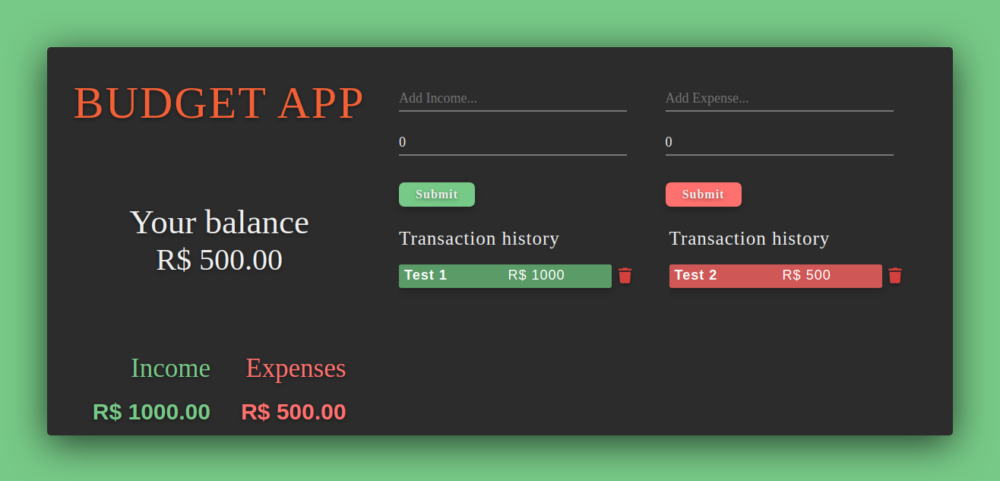

<h1 align="center">
  <strong>Budget App</strong>
</h1> 

A tool to centralize your earnings and expenses.

 

## 🎨 Screens

<h3 align="center">
  
</h3>

## ✅ Features
- Add income
- Add expense
- Summary of registered data

## 🧰 Tools

- [ReactJS](https://pt-br.reactjs.org/)
- [Context API](https://https://pt-br.reactjs.org/docs/context.html/)
- [Styled-Components](https://styled-components.com/)

## 👩‍🏫 Getting Started

- Cloning project
  - `git clone https://github.com/Hilderlan/budget.git`;
  - `cd budget`;
- Run
  - `yarn install`;
  - `yarn start`;
 
## 🙋‍♂️ Author

* **Hilderlan Almeida** - [Hilderlan](https://github.com/Hilderlan)